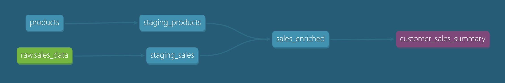
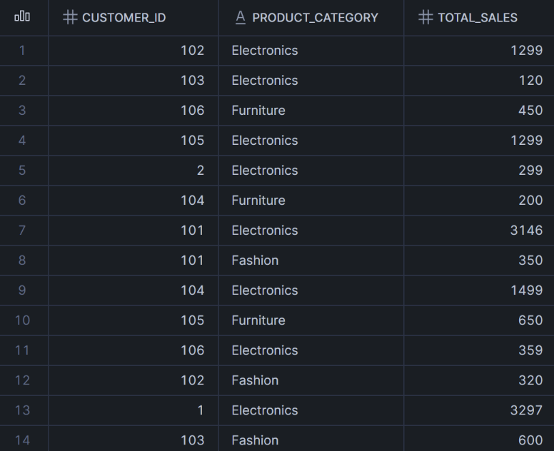

# dbt Sales Transformation Project

## Overview

This project demonstrates an end-to-end ELT pipeline built using dbt and Snowflake. It integrates transactional sales data with product metadata to generate aggregated business insights.

The pipeline follows a modern data modeling approach with staging and mart layers.

---

## Tech Stack

* dbt (data transformation)
* Snowflake (data warehouse)
* GitHub (version control)

---

## Data Sources

### 1. Sales Data

* Source: Snowflake table (`sales_data`)
* Contains transactional order data

### 2. Product Data

* Source: CSV file (`seeds/products.csv`)
* Contains product metadata
* Loaded using dbt seeds

---

## Project Structure


```
models/
  staging/
    staging_sales.sql
    staging_products.sql
  marts/
    sales_enriched.sql
    customer_sales.sql

seeds/
  products.csv
```

---

This project follows a layered data modeling approach using dbt:

```text
Raw layer → Staging layer → Transformation layer → Mart layer
```
---

## Transformations

### Staging Layer

* Cleans and standardizes raw data
* Ensures consistent column naming and structure

### Transformation Layer

* `sales_enriched` joins sales data with product metadata
* Calculates total sales using:

  total_sales = quantity × price

### Mart Layer

* `customer_sales_summary` aggregates total sales
* Provides business-ready insights by telling us total sales per customer per category

---

## Key Metric

total_sales = quantity × price

---

## Running the Project

To run the pipeline, load seed data:


```
dbt seed
```

Run transformations:

```
dbt run
```

Run tests:

```
dbt test
```

Generate docs and lineage:

```
dbt docs generate
dbt docs serve
```

---

## Data Lineage

Following is the lineage graph for `customer_sales_summary`:



### Explanation

**1. Data Sources (Inputs)**

- `products` (blue): comes from dbt seed (CSV file)
- `raw.sales_data` (green): comes from Snowflake raw table

---

**2. Staging Layer**

- `staging_products`: cleans and standardizes product data
- `staging_sales`: cleans and standardizes sales data

---

**3. Transformation Layer**

- `sales_enriched`: joins sales and product data
- Adds business meaning by combining datasets

---

**4. Mart Layer (Final Output)**

- `customer_sales_summary`: aggregates total sales  
- Answers the business question:  
  “How much did each customer spend per product category?”

---

## Example Output from Snowflake



---

## Deliverables

- dbt transformation model: `models/marts/customer_sales_summary.sql` takes cleaned data (staging_sales, staging_products), joins them (via sales_enriched), aggregates results and outputs final dataset
- Documentation: README.md for data sources and transformations and dbt schema.yml for model level metadata and tests
- SQL logic: implemented via dbt models, which it compiles and executes as a CREATE VIEW statement in Snowflake  

---

## Key Learnings

* Built modular ELT pipelines using dbt
* Used seeds for reproducible data ingestion
* Applied layered data modeling approach
* Implemented testing and documentation
* Used Snowflake for scalable transformations
